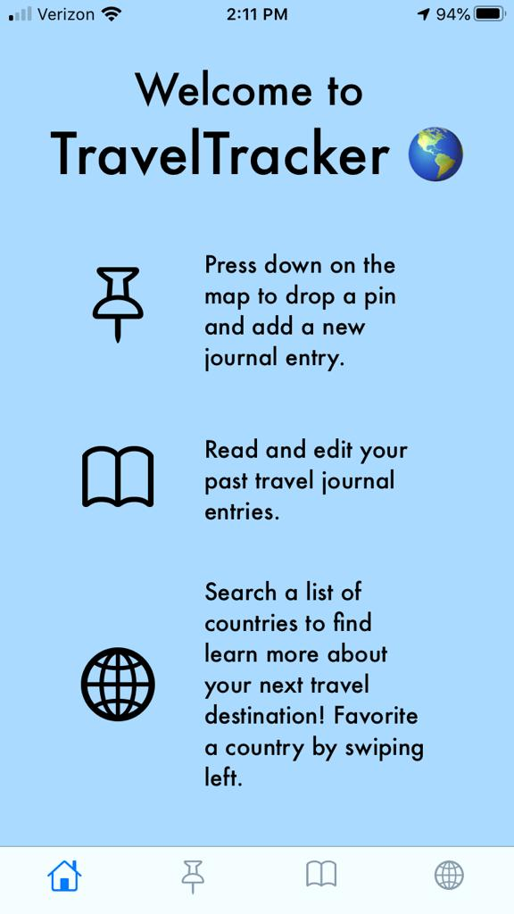
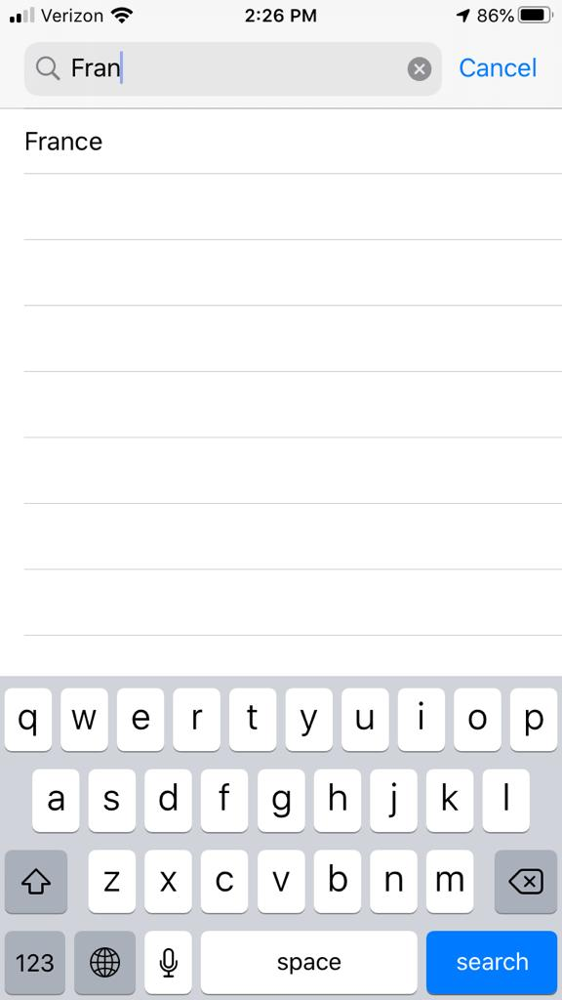
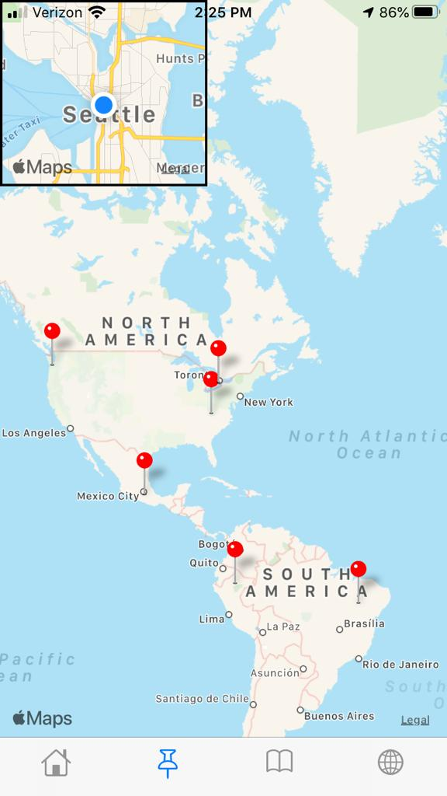
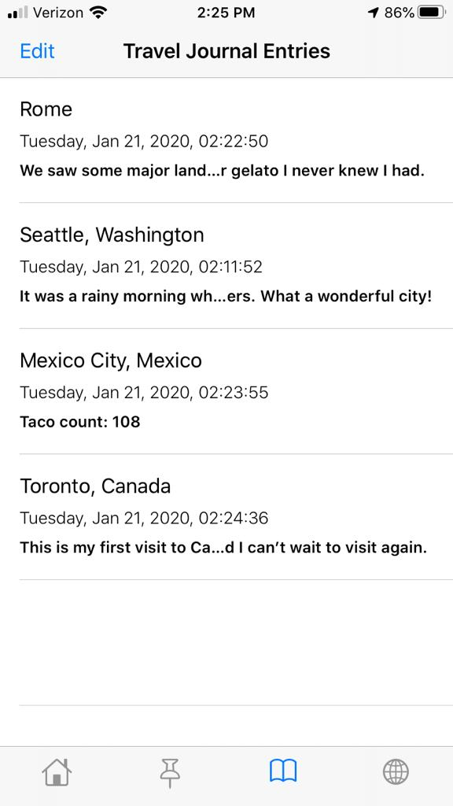
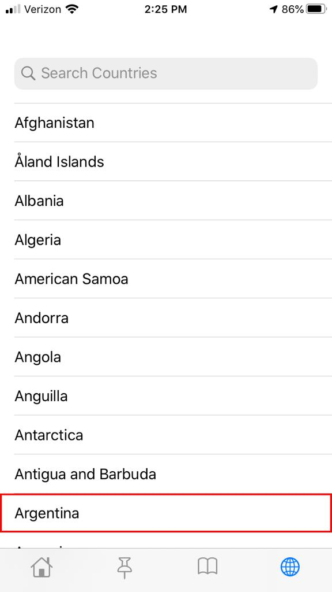
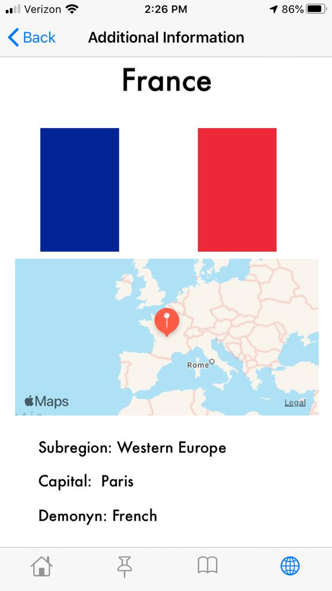

# **Welcome to Travel Tracker!**

## Background
Although many travel apps exist that allow you to create an itinerary for upcoming trips, not many allow you to reflect on your past travels or learn more about potential destinations in the future. TravelTracker works as a travel journal, allowing you to reflect on past travels and visualize where you have visited. In addition, TravelTracker works with an API to provide details on a list of world countries and see where they are located on the world map to learn more about the world and hopefully inspire the world traveler within!

## Installation
1) This program requires XCode to run the program. 
2) Upon cloning and running the program, no additional dependencies are required.
3) The details page relies on the use of Rest Countries API, but no API key is required. 
4) Internet acess is required to load the country details. 

## Demo

## Credits

This project utilizes this tutorial for note taking and core data implementation by author Lazlo Harri Nemeth: https://medium.com/thecodinghype/creating-a-simple-note-taking-app-for-ios-in-swift-66dcbfe05a30

